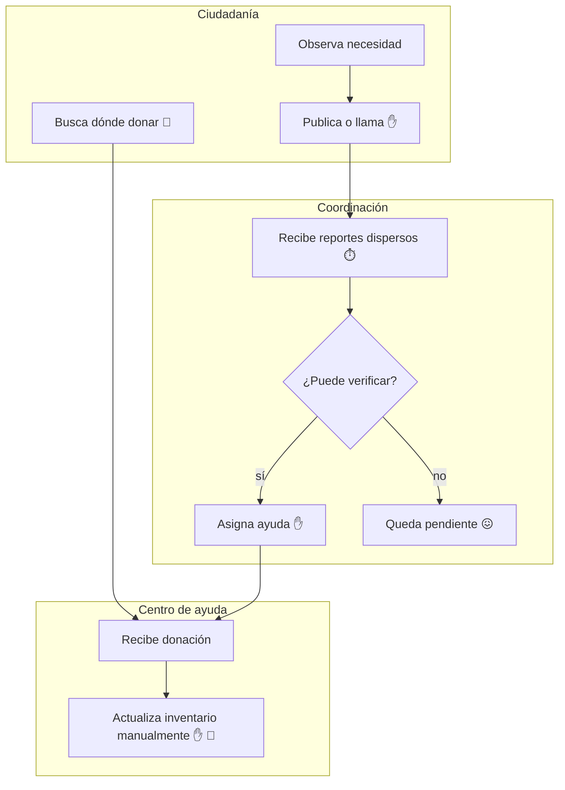

# AS-IS — coordinación de ayuda posterior al terremoto

**Nivel:** L2. **Pregunta:** ¿por qué una donación o reporte no llega necesariamente a la zona que lo necesita?

| S | I | P | O | C |
|---|---|---|---|---|
| Ciudadanía, Alcaldía, socorristas | Reportes, inventario, llamadas | reportar → publicar → validar → coordinar → entregar | Ayuda y estado territorial | Familias, operadores, donantes |

Leyenda: ✋ paso manual · 😖 dolor · 📵 sin métrica · ⏱️ espera.

| Gap | Evidencia AS-IS | Impacto | Factibilidad | Dueño | TO-BE propuesto |
|---|---|---:|---:|---|---|
| Reportes fragmentados | Redes y llamadas sin formato común | 5 | 5 | Producto | Formulario territorial único |
| Estado envejecido | No existe caducidad visible | 5 | 4 | Operación | Vigencia y reconfirmación |
| Oferta no coincide con demanda | Inventarios y necesidades separados | 5 | 4 | Logística | Matching por categoría y proximidad |

