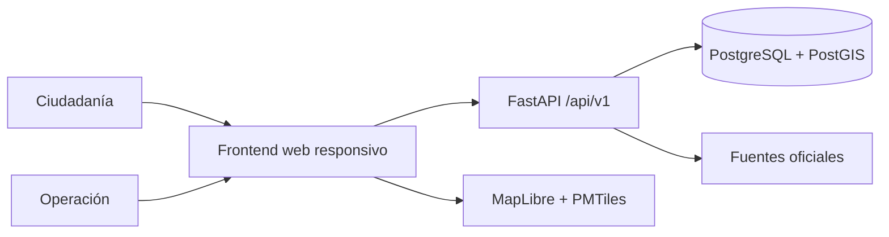

# Arquitectura actual

## Decisión

Ayuda Colombia se implementa como dos componentes desplegables: una aplicación web responsiva de consulta/reporte y una API stateless. PostgreSQL/PostGIS es la fuente de verdad; el mapa nunca lo es. El soporte offline y la instalación como PWA aún no están implementados.

## Fronteras

- `frontend`: presenta datos y no decide la veracidad de un reporte. Actualmente requiere conexión para enviar; la cola offline es deuda prioritaria.
- `backend`: valida contratos, autorización, estado de verificación y auditoría.
- `PostGIS`: asigna territorialmente los puntos y ejecuta consultas espaciales.
- proveedores cartográficos: solo visualización, búsqueda o rutas; no son autoridad sobre barrios.

## Flujo de dependencias

El backend aplica `Router → Service → Repository`. Los routers no contienen reglas de negocio ni
consultas; los servicios controlan autorización y estados; los repositorios son la única capa que
usa SQLAlchemy. Consulta el
[ADR de servicios y confianza pública](adr/0001-domain-services-and-public-trust.md).

El frontend usa TanStack Query para datos remotos. El estado local queda reservado para interacción
de la interfaz, como la región seleccionada, los filtros y la apertura de paneles.

## Reglas humanitarias

- Todo dato cambiante incluye `observed_at`, `verification_status` y `source`.
- Un reporte ciudadano nunca se etiqueta como oficial automáticamente.
- No se publican nombres, teléfonos ni coordenadas precisas de personas vulnerables.
- La disponibilidad de un centro caduca y debe reconfirmarse.
